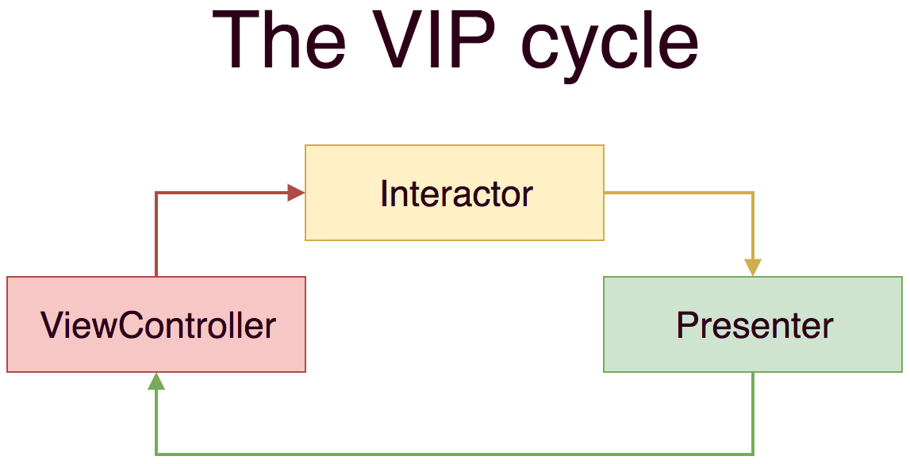

## GameList VIP(Clean) Sample App

The three main components of Clean Swift are the view controller, interaction, and presenter. They act as input and output to one another as shown in the following diagram.  

The output of the view controller is connected to the input of the interactor. The output of the interactor is connected to the input of the presenter. The output of the presenter is connected to the input of the view controller. This means the flow of control is always unidirectional.

Used 3rd party libraries with CocoaPods  
Alamofire

You need to get Rapid and RAWG API keys for running the app. You may use the following URLs to get it and put them APIContans.swift file. 
https://rapidapi.com/accujazz/api/rawg-video-games-database  
https://rawg.io/apidocs
